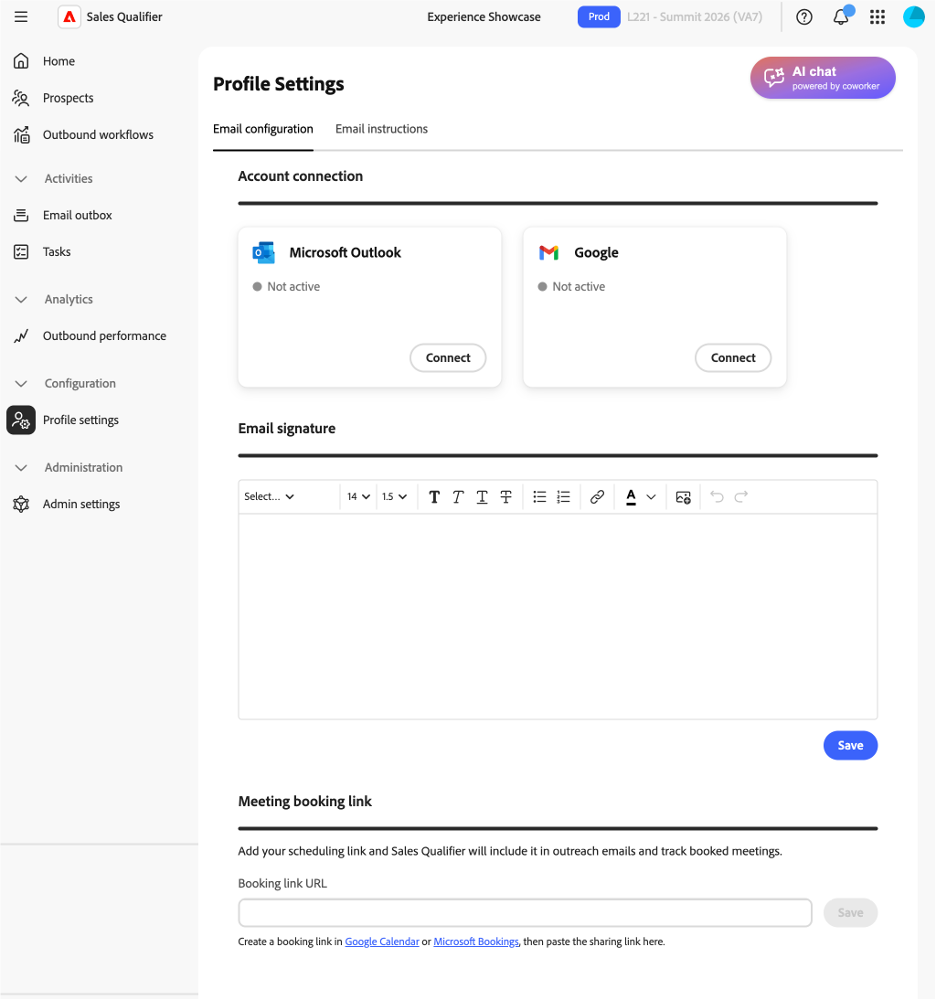

# Profile settings

In the left navigation, expand **[!UICONTROL Configuration]** and select **[!UICONTROL Profile settings]**. Use these settings to manage your personal details, email connection, calendar, and chat availability.

## Email settings

In the **[!UICONTROL Email settings]** tab, set up your email connections.

* **[!UICONTROL Email connections]** — Select Microsoft Outlook or Google and follow the sign-in process. See [Connect Outlook](integrations.md#connect-outlook) for the access you approve and the administrator approval path, if required.
* **[!UICONTROL Email signature]** — Add or update the signature used in generated emails. Include your [meeting booking](outbound-workflows.md#meeting-booking) link so that prospects can schedule time with you.
* **[!UICONTROL Meeting booking link]** - Send a meeting invite within your emails. Takes the meeting URL.

### Email drafting context

Use **[!UICONTROL Email drafting context]** to set the email tone, structure, and style, so that emails are consistent.

Write your context in plain markdown on the **[!UICONTROL Email drafting context]** area. 
Use it to define:

* Tone and voice
* Structure and length
* Personalization and greeting rules
* Subject-line style
* How engagement signals are used
* How metrics, proof points, and customer stories are framed

By default, drafts use a house-style context, so your existing drafts do not change until you add your own context.

## Calendar configuration

On the **[!UICONTROL Calendar configuration]** tab, set your time zone and availability.

* **[!UICONTROL Calendar connection]**—Select **[!UICONTROL Connect]** and follow the Microsoft sign-in process.
* **[!UICONTROL Meeting confirmation email]**—Define the subject and body of the confirmation email that a prospect receives after booking a meeting.
* **[!UICONTROL Preferences]**—Set the default meeting length and the buffer between meetings.

If you disconnect your calendar:

* Active booking links stop working.
* The booking page shows a temporary unavailability message.
* Your settings are preserved when you reconnect.

## Calendar availability

Your calendar availability in Sales Qualifier is based on two inputs:

* Your connected work calendar, such as Outlook or Gmail
* The availability and time-slot rules in **[!UICONTROL Calendar configuration]**

Sales Qualifier reads free/busy status, not event details, from the connected calendar. It combines this status with your rules to determine the time slots that prospects can book.

You can configure:

* Working hours by day of week
* Multiple blocks per day, for example, 9:00 a.m.–noon and 1:00–5:00 p.m.
* Your time zone
* Meeting duration
* Buffer before and after meetings
* Minimum notice
* Booking window

>[!MORELIKETHIS]
>
>* [Outbound Workflows](outbound-workflows.md)
>* [Integrations](integrations.md)
>* [Tasks](tasks.md)
